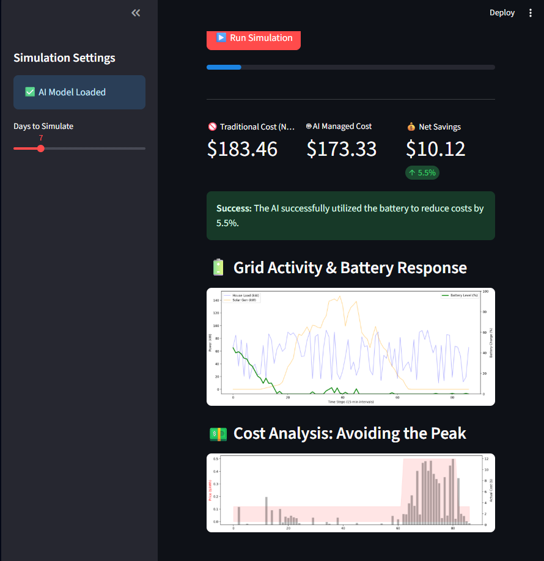

title: RL Energy Grid Optimizer
emoji: "⚡"
colorFrom: blue
colorTo: green
sdk: streamlit
app_file: src/dashboard.py
pinned: false

# ⚡ Autonomous Energy Grid Optimization (RL-PPO)

### 🚀 Business Case
Energy grids suffer from inefficiency due to volatile pricing and intermittent renewable generation (Solar/Wind). This project deploys a **Deep Reinforcement Learning (PPO) agent** that acts as an autonomous microgrid controller.

**The Result:** The AI agent achieved **5.5% cost savings** compared to a standard grid controller by autonomously learning to store solar energy and discharge it to offset base loads.

### 🏗️ Architecture
* **Brain:** Proximal Policy Optimization (Stable-Baselines3).
* **Simulation:** Custom Gymnasium Environment (`GridEnv`) simulating battery physics and grid pricing.
* **Data:** Real-world load/solar profiles (NREL Database) calibrated for Nigeria (Lagos) grid context.
* **Frontend:** Streamlit Interactive Dashboard for ROI analysis.

### 🛠️ Tech Stack
* Python 3.9
* PyTorch (via Stable-Baselines3)
* Pandas (Time-series Data Engineering)
* Streamlit (Visualization)

### 📸 Dashboard Demo

### 💻 How to Run
1. Clone the repo
2. Install dependencies: `pip install -r requirements.txt`
3. Train the agent: `python src/train_agent.py`
4. Launch the dashboard: `streamlit run src/dashboard.py`
